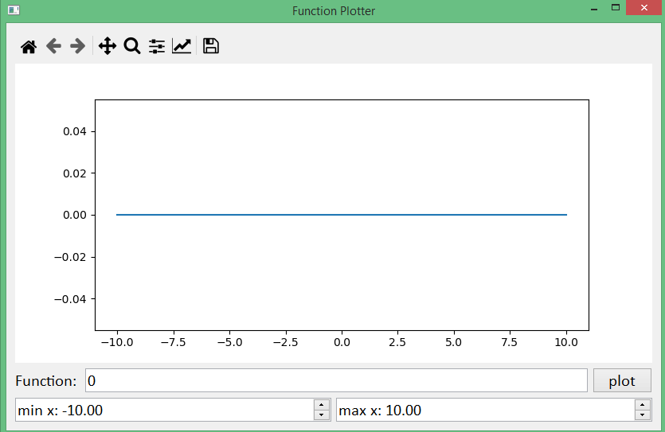

# Function Plotter

## Python GUI program that plots arbitrary user-entered math function using [*PySide2*](https://pypi.org/project/PySide2/) & [*matplotlib*](https://matplotlib.org/stable/contents.html) and supported with some GUI tests using [*pytest-qt*](https://pytest-qt.readthedocs.io/en/4.0.2/index.html)

### Working Examples

### Wrong Examples

